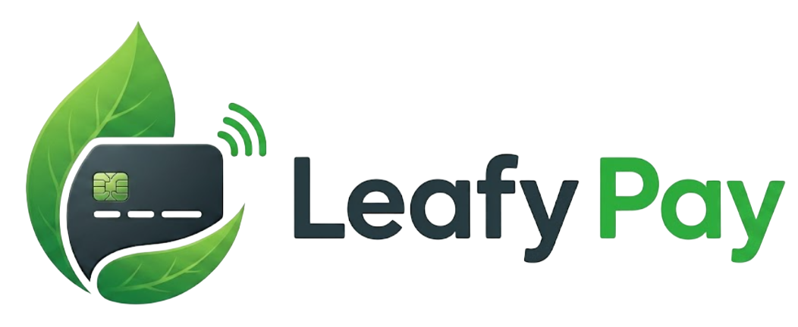

# 🏦 Securit4 Pay: FSI PSP + PCI DSS + MongoDB



> A Payment Service Provider (PSP) solution: a PCI DSS-aligned platform used by digital banks or card issuers to authorize card payments, detect fraud, and investigate cases. It runs the full payment lifecycle on MongoDB Atlas, from checkout and authorization, through automated transaction scoring, to multi-tier analyst investigation and resolution.

**Core message:** *🔐 Encrypt everything. 🔍 Query anything. 🔑 Keys are yours.*

---

## 🎯 What This Demo Shows

A PSP platform uses **MongoDB Queryable Encryption (QE)** with **AWS KMS** to protect cardholder data. The server stores only ciphertext. Fraud analysts still search encrypted fields by email, phone, and account reference: without server-side decryption. Access is controlled by role. Every action is audited.

This answers the most common FSI prospect question:

> *"How can we keep payment data fully encrypted and still run fraud investigations at speed?"*

---

## ⚡ Key MongoDB Capabilities Demonstrated

| Capability | What the Demo Shows |
|---|---|
| 🔐 **Queryable Encryption (equality)** | Search encrypted email, phone, and account reference (PII fields) |
| 🔒 **Queryable Encryption (none mode)** | Protect address and government ID; reveal only under escalation (v2) |
| 🔑 **AWS KMS integration** | Customer-controlled master key; MongoDB has zero access |
| 👤 **RBAC** | Level 1 Analyst vs Level 2 Investigator field visibility (v2) |
| 📋 **Atlas Audit Log** | Per-field access trail in the investigation workflow (v2) |
| 🌐 **TLS 1.3** | All Atlas connections encrypted in transit by default |

---

## 🏛️ Regulatory Alignment

- **PCI DSS v4.0**: MongoDB Atlas certified September 2023
- **BIAN** (Banking Industry Architecture Network): data model follows BIAN Service Domain naming conventions

---

## 🎬 Demo Flow

```
💳  Customer pays with credit card
         ↓
🔒  PAN tokenized in the browser: never transmitted or stored
         ↓
🔐  PII fields encrypted client-side before reaching MongoDB Atlas
     (customerEmailAddress, customerMobilePhoneNumber, cardTransactionAccountReference, ...)
         ↓
🚨  Suspicious transaction triggers a Fraud Diagnosis Case
         ↓
🕵️  Level 1 Analyst searches by encrypted email: finds the record
     MongoDB server never decrypted the field
         ↓
⬆️  Analyst escalates → Level 2 Investigator reveals sensitive fields (v2)
         ↓
📋  Complete audit trail: who accessed what, when, under which role (v2)
```

---

## 🚀 Quick Start


To begin the process of testing, installation, and execution, please follow the instructions in [the installation guide](https://github.com/mongodb-industry-solutions/sec-fsi-pci-dss/wiki/installation).

---

## 🗄️ Data Architecture

The data model follows **BIAN Service Domain** naming conventions across 8 collections:

| Collection | BIAN Service Domain | QE Protection |
|---|---|---|
| `partyAuthenticationAssessment` | Party Authentication (SD-16) | equality: user email |
| `cardTransactionLog` | Card Transaction (SD-254) | equality: account reference; QE:none fields (gateway payload, processor metadata) are **inline** in the same document — no separate sensitive collection |
| `customerAgreementProcedure` | Customer Agreement (SD-53) | equality: email, phone, account reference; QE:none: address, government ID |
| `paymentCardManagement` | Payment Card (SD-88) | none: expiry date; card token is plaintext (not CHD) |
| `fraudDiagnosisCase` | Fraud Diagnosis (SD-83) | plaintext: operational metadata only |
| `fraudDiagnosisCaseEvents` | Fraud Diagnosis (SD-83) — audit log | plaintext: immutable event records (notes, escalations, accesses) |
| `party` | Party (SD-13) | equality: PII identifiers |
| `customerAuthenticationAssessment` | Customer Authentication (SD-91) | equality: credential hash |

> Full schema definitions, field-level QE modes, index strategy, and collection relationships are in [docs/technical-spec.md](docs/technical-spec.md).

---

## 🛡️ PCI DSS Alignment

This demo demonstrates a **PCI DSS-aligned reference architecture**. MongoDB Atlas holds PCI DSS 4.0 certification. The customer remains responsible for their own PCI compliance program.

Key PCI DSS v4.0 requirements addressed:

- ✅ **Req 3**: Cardholder data encrypted before storage; SAD (CVV, PIN) never stored
- ✅ **Req 3.6**: Customer-controlled key management via AWS KMS
- ✅ **Req 4**: TLS 1.3 on all Atlas connections
- ✅ **Req 7**: Role-based field visibility (v2)
- ✅ **Req 10**: Audit log for all field access events (v2)

---

## 📁 Repository Structure

```
sec-fsi-pci-dss/
├── 💻 frontend/        # Next.js 14 App Router + TypeScript
├── ⚙️ backend/         # Fastify 4 + TypeScript + NPM Tools (setup + seed)
└── 📚 docs/            # Engineering documentation
```

---

## 🏗️ Technology Stack

| Layer | Technology |
|---|---|
| 💻 Frontend | Next.js 14 App Router + TypeScript |
| ⚙️ Backend API | Fastify 4 + TypeScript |
| 🗄️ Database | MongoDB Atlas (M10+) with Queryable Encryption |
| 🔑 Key Management | AWS KMS (local KMS fallback for offline demos) |
| 📦 Project setup | npm workspaces + concurrently |
| 🎨 UI Design | LeafyGreen Design System |

---

## 🗺️ Roadmap

| Version | Theme | Status | Key Features |
|---|---|---|---|
| 🟢 **v1** | Security Foundation | Complete | Payment simulation, JWT auth, dual-mode UI, QE encryption visible, fraud investigation |
| 🔵 **v2** | Investigation & Control | In Development | RBAC, escalation workflow, audit trail, HRPC check, profile management |
| 🟠 **v3** | Integration-ready API Surface | Planned | Recurring payments, webhook events, stable OpenAPI contracts, performance visualization, Leafy Bank scaffold |
| 🟣 **v4** | Payment Gateway + Integration Refinement | Planned | Modular backend (BIAN SD modules), gateway API, merchant as first-class actor, full payment order lifecycle |
| 🔴 **v5** | Agentic Integration | Planned | AI agent (Magenta / ThreatSight360) for automated fraud pre-review; draft diagnosis with Accept / Override |

See [Scope](https://github.com/mongodb-industry-solutions/sec-fsi-pci-dss/wiki/Scope) for a detailed breakdown of what each iteration implements, what is out of scope, and how this compares to a real payment gateway. For the complete FR, NFR, and acceptance criteria per iteration, see [docs/roadmap.md](https://github.com/mongodb-industry-solutions/sec-fsi-pci-dss/blob/staging/docs/roadmap.md).

---

## 📚 Documentation

| Document | Description |
|---|---|
| 📖 [Project Wiki](https://github.com/mongodb-industry-solutions/sec-fsi-pci-dss/wiki) | Installation guide, Q&A, and additional resources for non-engineering readers |
| 📋 [PRD](docs/PRD.md) | What and why: audience, storyline, BIAN data model, QE design overview |
| 🗺️ [Roadmap](docs/roadmap.md) | FR and NFR per iteration (v1 / v2 / v3 / v4) with acceptance criteria and Definition of Done |
| 🛠️ [Technical Specification](docs/technical-spec.md) | BIAN TypeScript interfaces, QE `encryptedFieldsMaps`, API contracts, index strategy |
| 🏗️ [Engineering Proposal](docs/engineering-proposal.md) | Architecture decisions, implementation phases, risks, alternatives, ADRs |
| 🗂️ [Architecture Overview](https://github.com/mongodb-industry-solutions/sec-fsi-pci-dss/wiki/architecture) | Data model, PII fields, encryption design, collection relationships, and role model |
| ❓ [Q&A: PCI DSS](https://github.com/mongodb-industry-solutions/sec-fsi-pci-dss/wiki/q&a) | Common FSI client questions about MongoDB and PCI DSS compliance |
| 🐛 [Issues](https://github.com/mongodb-industry-solutions/sec-fsi-pci-dss/issues) | Bug reports, feature requests, and task tracking |

### External References 
- [Redsys: Continue with the Integration](https://pagosonline.redsys.es/desarrolladores-inicio/continar-integracion/)
- [Redsys: Virtual POS Integration Models](https://pagosonline.redsys.es/desarrolladores-inicio/)
- [Redsys: Make a payment](https://pagosonline.redsys.es/desarrolladores-inicio/documentacion-operativa/autorizacion/#rest)
- [Redsys: Card validation (authentication)](https://pagosonline.redsys.es/desarrolladores-inicio/documentacion-operativa/operacion-autenticacion/)
- [Redsys: PSD2 and Strong Customer Authentication (SCA)](https://pagosonline.redsys.es/desarrolladores-inicio/documentacion-operativa/autenticacion-reforzada-sca-y-normativa-psd2/)

---

## ⚠️ Disclaimer

This demo uses **synthetic data only**. No real cardholder data, personal information, or production credentials are included. The demo is a reference architecture illustration and does not constitute a PCI DSS compliance certification or legal compliance advice.
