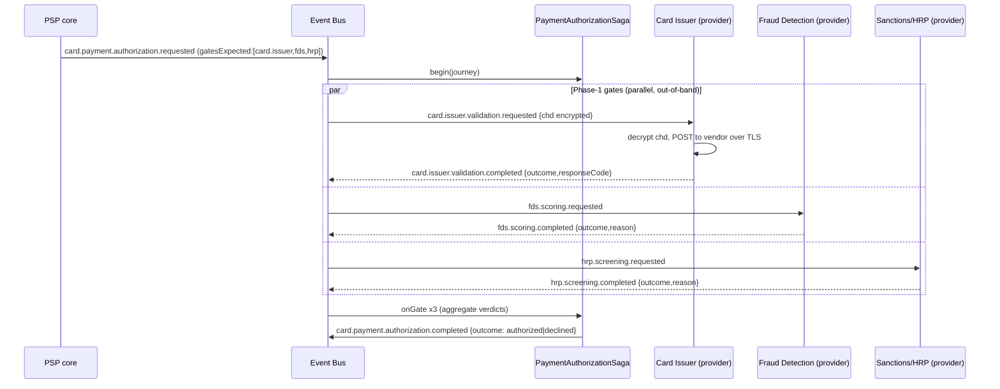

## **Architecture Reference Document for PSP Systems**

### **1. Event-Driven Architecture (EDA)**  
The entire PSP system is to be built and operated based on an Event-Driven Architecture. This approach ensures efficient processing of business flows asynchronously, with the **Event Bus** serving as the core component responsible for managing the sequence of events.

#### **Key Concepts:**  
1. **Event Bus Core:**  
   A centralized component that emits and manages events, facilitating business processes. Each business process is represented as a sequence of events, which the system processes asynchronously.

2. **Business Process Examples:**  
   - **Payments:** API Payment, Redirection Payment, Payment Link.  
   - **User Validation:** Know Your Customer (KYC).  
   - **Merchant Validation:** Know Your Business (KYB).  
   - **Investigative Case:** Fraud analysis and merchant investigations.

3. **Process Definition:**  
   - **Sequence of Events:** Each business process defines a clear event sequence. The PSP core must use the Event Bus to emit events with the correct payloads at the appropriate steps of the process, ensuring proper handling by external or internal systems.  
   - **Process Identifiers:** Each business process must define a unique identifier (e.g., transaction ID, case reference) to track and manage all associated events. This facilitates system auditing, making it possible to trace the lifecycle of processes and responses.

---

### **2. Hexagonal Architecture**  
To ensure flexibility and scalability, the PSP system adopts a **Hexagonal Architecture**. This design allows seamless interaction between the core system and external modules or subsystems.

#### **Key Design Principles:**  
1. **Provider Categories:**  
   Integration is divided into the following distinct **categories**, which play specific roles within different business workflows:
   - Fraud Detection System (FDS)  
   - Human Resource Processes (HRP)  
   - Anti-Money Laundering (AML)  
   - Know Your Customer (KYC)  
   - Know Your Business (KYB)  
   - Card Issuer  
   - Credit Bureau  
   - Card Authorization  

2. **Provider Groups:**  
   - Each category defines a **Provider Group**, which is responsible for managing multiple providers with a common business goal.  
   - Providers within the same group respond to the same events but may offer different strategies for execution. For instance:
     - In the **Card Issuer** group, multiple providers may handle card validation events (e.g., CVV, PIN verification).  
     - The execution strategy may focus on default provider selection or fallback mechanisms, where the next provider in the group handles the request if the first one fails.

3. **Providers:**  
   - A **Provider** is equivalent to a **Port** in the Hexagonal Architecture. It defines the **inbound** and **outbound** behaviors for specific events it handles.  
   - Providers interact directly with external systems or modules for event processing.  

4. **Provider Event Configurations (configured per event, per vendor):**  
   The configuration scope is layered — getting this wrong breaks the model:
   - A **Provider Group** (category) routes to **one or more Vendors** (connectors).
   - A **Vendor** (External Provider) carries its **vendor-global** config, managed once at vendor level: **Overview**
     (identity, status, vendor-level metadata), **Routing** (how the group picks among its vendors:
     default + fallback / strategy), and the list of **Events** it handles. **There is no vendor base
     URL.**
   - **Each event a vendor handles has its OWN Outbound and Inbound configuration**, including **its
     own URLs**: the outbound endpoint the PSP calls and the inbound callback URL the vendor calls
     back. A vendor handling three events has three independent outbound/inbound configs. URLs,
     mapping, auth, retries and timeout are **never** vendor-global — they are **always per event**.
     (See §7.7: each event's wire contract.)

   - **Outbound Configuration (per event):**  
     - Defines how outgoing attributes are mapped between the PSP system and external systems. For example:
       - If the PSP emits an event with a field `cvv`, but the external system expects `cvvData`, mapping ensures compatibility by transforming `cvv` into `cvvData`.  
       - Similar mapping applies to headers (e.g., transforming `authorization` into `X-Authorization`).  
     - Each event configures security features like API Keys, HTTP action methods (POST, GET, etc.), retries, timeout settings, etc.  
     - Provider-specific configurations (e.g., security and data formats) must align with their category.  

   - **Inbound Configuration (per event):**  
     - Defines how responses from external systems to that event are processed via inbound callbacks.  
     - Mapping of inbound attributes (body **and** header) ensures the system properly interprets external data.  
     - Security measures (e.g., authenticity checks, anti-spoofing techniques) must verify that the response comes from legitimate external systems.

5. **External Systems/Adapters:**  
   - External systems (referred to as **vendors**) act as adapters that implement the PSP-defined Ports.  
   - These systems must process requests and provide responses via the defined callback endpoints.

6. **Modules:**  
   - **Built-in Provider Modules:**  
     Internal implementations of provider categories that ship with the PSP system. They are **not considered part of the PSP core** — they are replaceable subsystems that can be substituted by external vendors at any time. Despite being implemented internally, each built-in provider is treated architecturally as an independent external system.

     The following built-in providers ship with the system:

     | Module | Category | Role |
     |---|---|---|
     | `card-issuer` | Card Issuer | Default card validation (CVV, PIN, authorization) |
     | `fds` | Fraud Detection System | Internal rule-based fraud scoring |
     | `hrp` | Human Resource Processes | Internal sanctions and PEP screening |
     | `aml` | Anti-Money Laundering | Internal transaction monitoring |
     | `kyc` | Know Your Customer | Internal identity verification for customers |
     | `kyb` | Know Your Business | Internal business verification for merchants |
     | `credit-bureau` | Credit Bureau | Internal credit scoring and assessment |
     | `card-authorization` | Card Authorization | Internal card authorization processing |

     **Admin panel labeling:** The administration route `/system/admin/modules` lists **all configurable modules** in the system — both PSP core modules (e.g., `domain`, `gateway`, `identity`) and built-in provider modules (e.g., `fds`, `card-issuer`). Because both types appear in the same list, every entry must display a **module type label** (e.g., `Core` or `Built-in Provider`) so operators can tell at a glance whether they are configuring a core system behavior or a replaceable provider adapter.

   - **Implementation contract (mandatory):**  
     Built-in providers **must strictly implement the same architectural interfaces and definitions** established for external vendors. The integration mechanism is identical — event-driven dispatch via the Event Bus, the same inbound/outbound attribute mapping contracts (§7.7), the same authentication and callback URL configuration, retries, and timeouts. There is **no shortcut path**: no built-in implementation may hardcode behavior, bypass the EDA + Hexagonal boundary, or couple directly to the PSP core. Violating this contract defeats the substitutability guarantee and pollutes the architectural baseline.

   - **Configuration & Response Handling:**  
     - Modules must implement the inbound/outbound requirements of the provider for specific events.  
     - Callback URLs and configurations for modules are dynamic and must support easy replacement by external systems.

#### **Directory Structure:**

| Directory | Purpose |
|---|---|
| `backend/src/modules/` | PSP core — business domains and process orchestration |
| `backend/src/providers/` | Built-in provider modules — replaceable adapters (see §2.6) |
| `backend/src/shared/` | Shared business resources reused by both `modules/` and `providers/` |
| `backend/src/vendors/` | System-level libraries with no business logic (event bus, encryption, middleware, seed, setup) |

**Shared resources (`backend/src/shared/`).** Any business type, interface, utility, or constant needed by more than one module or provider must live in `shared/` — never duplicated across consumers. Both `modules/` and `providers/` import from `shared/`; neither imports from the other. `vendors/` is imported by all layers but never imports from `modules/`, `providers/`, or `shared/`.

**Internal structure convention.** Every directory under `modules/`, `providers/`, and `shared/` follows the same standard layout. Only the subdirectories actually required by that unit are created — do not invent new names:

```
<unit>/
  controllers/   # request handling (only if the unit exposes HTTP endpoints)
  services/      # business logic
  models/        # TypeScript interfaces and types
  config/        # configuration constants and maps
```

**File-per-class rule.** Each service, controller, and config must be its own file. For models, use one file per class unless the interfaces are small *and* belong to the same family (e.g., a group of related request/response shapes with little content); in that case they may be co-located in a single file. The deciding criterion is semantics and readability — never convenience. No duplication across units: if a type is used in more than one place it belongs in `shared/models/`.

---

### **3. Pattern and System Design Rules**  

1. **Event Bus Implementation:**  
   - The Event Bus should provide an **in-memory MongoDB-based implementation** by default for simplicity and local deployment.  
   - Scalability through pluggable engines (e.g., RabbitMQ, Kafka, etc.) must be available via a **Strategy Pattern**. Configuration should allow easy switching between engines without requiring code changes.  
   - The PSP core and Provider Groups must interface with the global Event Bus without direct dependence on the underlying technology.

2. **Programming Paradigm:**  
   - The system follows **Object-Oriented Programming (OOP)** principles, utilizing interfaces and strong type definitions to maintain clarity and ensure extensibility.  
   - A strict **maximum inheritance depth of 3 levels** must be adhered to, avoiding anti-patterns. Functional programming may only be applied for extremely simple, localized tasks.

3. **PCI DSS Compliance:**  
   - All data flows and system interactions must strictly adhere to PCI DSS standards to ensure the security of sensitive payment information.

4. **Data Architecture Principles:**  
   - The system must follow the **BIAN (Banking Industry Architecture Network)** standards for data structure and information flow.  

---

### **4. Development Best Practices**  

1. **KISS Principle:**  
   - Keep code simple and avoid unnecessary complexity.  
   - Minimize duplication of code, variables, constants, models, interfaces, and collections.  
   - Reuse components whenever possible to simplify maintenance and scalability.

2. **Commenting Standards:**  
   - Use **JSDoc** format for comments.  
   - All documentation must be concise, written in English, and limited to 2 lines per comment. Avoid excessive commenting and refrain from including progress details in comments.

3. **Resource Efficiency:**  
   - Optimize resource usage for maximum performance.  
   - Prioritize system UX/UI responsiveness by minimizing latency and computational overhead.

---

### **5. Business Process Event Sequences**

This section is the **authoritative catalogue of events per business process**. Its purpose is to
standardize the choreography and to let us validate the flow *before* changing code. Every flow is
described as the real, code-backed sequence of `DomainEvent`s on the Event Bus.

#### **5.0 Event model and conventions**

- **Single Event Bus, by design (non-negotiable).** Every event in this section is published on and
  consumed through the one `EventBus` port — there is no parallel event channel and no service calls
  another service directly for these flows. Concretely:
  - **Provider calls are bus-driven:** a `*.requested` event is what triggers the outbound dispatch;
    the inbound callback re-enters the system by publishing the matching `*.completed`. Services do
    not invoke each other; they react to events.
  - **The other stores are projections, not channels:** `businessProcessEvent` /
    `complianceProcessEvent` (audit ledger) and `externalProviderArrangementActionLog` (HTTP wire
    log) are written off the bus flow; they never originate or relay domain events.
  - **SSE rides bus subscriptions:** live UI updates (case view, notifications) are bus subscribers,
    not a separate push mechanism.
  - **Transport is swappable:** because everything goes through the `EventBus` port, moving from the
    in-process adapter to Kafka/RabbitMQ changes only the adapter, not any publisher or consumer.
- **Envelope (`DomainEvent`)** — `eventId` (uuid, idempotency key), `eventType` (dotted name),
  `occurredAt`, `correlationId` (the journey instance), `causationId` (cause -> effect),
  `businessProcess` (the journey class), `source` (emitting component), `actor`, `bian`, `payload`,
  `schemaVersion`, optional `transient`.
- **`correlationId` = the journey.** For a payment it is the `cardTransactionInstanceReference`
  (`txnId`); post-auth AML (Phase 2) shares it. The investigation **case** has its own
  `correlationId = caseRef` and cross-links to the transaction (`payload.transactionId`), so the two
  trails are linkable but distinct (see §5.2 / §6.2). For onboarding/card-management it is the entity
  reference (party / card / merchant).
- **`businessProcess`** is the *class* used to group events:
  `card_payment | fraud_investigation | card_management | customer_onboarding |
  merchant_onboarding | provider_integration | system`.
- **Naming standard:** `<domain>.<subject>.<action>[.<phase>]`, lowercase, dotted. Two phase
  suffixes only, always as a symmetric pair: **`.requested`** (an async ask) and **`.completed`**
  (its result). There are no separate success/failure event names — the outcome
  (`authorized | declined | match | clear ...`) travels in the `.completed` payload.
- **Start/end per business process.** Every business process has exactly one opening event
  (`<process>.requested`) and one closing event (`<process>.completed`). Between them, each provider
  interaction is its own `<provider>.<action>.requested -> <provider>.<action>.completed` pair. The
  process `*.completed` is emitted once **all** the provider `*.completed` events it depends on have
  arrived; its payload carries the aggregated outcome. This gives a uniform, auditable template for
  every flow (payment, KYC, KYB, investigation).
- **Causation chain.** Each provider `*.requested` sets `causationId = <process>.requested.eventId`;
  each provider `*.completed` sets `causationId = its own *.requested.eventId`; the process
  `*.completed` sets `causationId =` the last provider `*.completed`. The full cause->effect graph of
  a journey is therefore reconstructable from the store.
- **Persistence layers** (do not confuse them):
  1. `domainEvent` — the Event Bus store, the canonical correlated journey (queried by `correlationId`).
  2. `businessProcessEvent` / `complianceProcessEvent` — the audit ledger; a **durable projection**
     written by a bus subscriber from the domain events. It never originates events. (Legacy code
     writes the ledger and mirrors to the bus; the migration flips this to publish-then-project — §9.2.)
  3. `externalProviderArrangementActionLog` — the outbound/inbound HTTP I/O with providers
     (`triggeredBy`), the request side of each `.requested`.
- **PCI DSS:** cardholder data stays fully event-driven. Raw CHD keys (`cardNumber`/`cvv`/`expiry`)
  are never allowed in a payload (`sanitizeDeep` strips them on every publish). To reach the Card
  Issuer, the CHD travels as a single **application-encrypted** envelope field (`chd`,
  opaque ciphertext) on the validation event. Every bus backend persists in-flight messages (Kafka
  log, RabbitMQ queue, in-process Mongo) — so the carrier event **is** persisted, but only
  **temporarily and encrypted**: the field is ciphertext at rest (Req 3.4) and is **purged (`$unset`)
  once the journey completes** (short/bounded retention), leaving the permanent trail record CHD-free,
  so SAD/CVV is not kept after authorization (Req 3.2); the audit ledger and action log never carry
  CHD at all. §8 specifies the store and purge mechanism. The Card Issuer
  **provider group is the consumer**: it reads the event, decrypts the CHD just-in-time, and dispatches
  it to the external provider per the outbound config over TLS (§7.7). Control logs are CHD-free
  (Req 10.7). See §7 intro and §7.7.

#### **5.1 `card_payment` — async two-phase authorization (core)**

`correlationId = txnId`. Phase 1 gates the authorization; Phase 2 runs post-auth (see 5.2).



| # | eventType | source | businessProcess | persisted | consumer / effect |
|---|---|---|---|---|---|
| 1 | `card.payment.authorization.requested` | `psp.core` | card_payment | yes | Saga `begin`; carries `gatesExpected` |
| 2a-req | `card.issuer.validation.requested` | `psp.core` | card_payment | yes | triggers issuer dispatch (CHD via HTTP only) |
| 2a-done | `card.issuer.validation.completed` | `callback.card-issuer` | card_payment | yes | Saga gate `card.issuer` |
| 2b-req | `fds.scoring.requested` | `psp.core` | card_payment | yes | triggers FDS dispatch |
| 2b-done | `fds.scoring.completed` | `callback.fds` | card_payment | yes | Saga gate `fds` |
| 2c-req | `hrp.screening.requested` | `psp.core` | card_payment | yes | triggers HRP/sanctions dispatch |
| 2c-done | `hrp.screening.completed` | `callback.hrp` | card_payment | yes | Saga gate `hrp` |
| 3 | `card.payment.authorization.completed` | `saga.payment-authorization` | card_payment | yes (+ audit projection) | resolves SSE; `{outcome}` drives merchant `payment.callback`; triggers Phase 2 |

- **One start, one end.** `card.payment.authorization.requested` opens the journey;
  `card.payment.authorization.completed` closes it, emitted once **all** gate `*.completed` events are
  in. Its payload carries `outcome: authorized | declined` (+ `responseCode`, `decisionReason`) — no
  separate `payment.authorized` / `payment.declined`, no `transaction.authorized` / `.declined`. The
  closing event is also projected to the audit ledger, so the compliance record is preserved.
- Each gate is a `*.requested -> *.completed` pair; the `*.completed` payload carries the per-gate
  `outcome` (no separate approved/declined event names). The HTTP dispatch to the provider is logged
  in `externalProviderArrangementActionLog` (the wire side of each `*.requested`).
- Gates are **fail-open** on transport error (only an explicit decline declines); the HRP/sanctions
  gate is the regulatory hard stop. The internal Card Issuer module is the default adapter; a real
  async issuer funnels its inbound callback into the same `card.issuer.validation.completed`.
- The synchronous `createTransaction` wrapper (checkout / payment-link) awaits the closing event, so
  those entry points are unchanged.

#### **5.2 `fraud_investigation` — post-auth + case lifecycle**

Begins from `card.payment.authorization.completed` (outcome=authorized). The AML sub-process uses the
payment `correlationId` (`txnId`); the case-lifecycle events use the case reference (`caseRef`) and
cross-link to the transaction in their payload. The case is a long-lived aggregate, so its events are
**discrete facts** (not request/response pairs); the only `*.requested -> *.completed` pair here is
AML monitoring.

| # | eventType | source | correlationId | trigger | persisted |
|---|---|---|---|---|---|
| 1 | `aml.monitoring.requested` | `psp.core` | txnId | on `card.payment.authorization.completed` (authorized) | yes |
| 2 | `aml.monitoring.completed` | `callback.aml` | txnId | AML provider verdict returned (`outcome` in payload) | yes |
| 3 | `fraud.case.opened` | `psp.core` | caseRef | open a case if required and not already open | yes (+ audit projection) |
| 4 | `fraud.case.enriched` | `psp.core` | caseRef | attach correlated subsystem signals to the open case | yes (+ audit projection) |
| 5 | `fraud.question.created` -> `fraud.question.answered` | `psp.core` | caseRef | investigator <-> customer Q&A | yes (+ audit projection) |
| 6 | `fraud.case.updated` | `psp.core` | caseRef | any case status/field change (incl. resolution) | yes (+ audit projection) |

- **One bus, no duplicate signal names.** The case view's live SSE subscribes to these **canonical
  persisted** events by `caseRef` — there are no separate transient `question.*` / `case.updated`
  signals. A single publish both persists the event and wakes the SSE subscriber.
- AML never blocks the (already authorized) payment. A late AML alert triggers `fraud.case.enriched`
  again (and `fraud.case.opened` first if no case exists yet).
- `fraud.case.enriched` always follows `fraud.case.opened`: enrichment adds correlated
  `subsystemSignals` (issuer + FDS + sanctions + AML) to an already-open case, so an investigator
  sees the full picture from one correlated query.

#### **5.3 `card_management`**

`correlationId = card token / customer agreement reference`. All projected to the audit ledger, all persisted.

| eventType | trigger |
|---|---|
| `card.registered` | card added (also auto-registered on first successful pay) |
| `card.accessed` | reveal/detail of a stored card |
| `card.updated` | card metadata change |
| `card.removed` | card deletion |
| `card.shared.threshold.exceeded` | same PAN shared across too many parties (risk signal) |

#### **5.4 `customer_onboarding` (KYC)**

`correlationId = customer/party reference`. Opening + closing process events wrap one KYC provider
pair. (Naming note: `profile.*` is used as proposed; `customer.profile.*` would make the domain
prefix explicit, consistent with `merchant.*` in 5.5.)

| # | eventType | source | persisted |
|---|---|---|---|
| 1 | `profile.validation.requested` | `psp.core` | yes (process opening) |
| 2 | `kyc.validation.requested` | `psp.core` | yes (triggers KYC provider dispatch) |
| 3 | `kyc.validation.completed` | `callback.kyc` | yes (provider verdict; `outcome` in payload) |
| 4 | `profile.validation.completed` | `psp.core` / process | yes (process closing, `outcome` aggregated) |

The HTTP I/O with the KYC provider stays logged in `externalProviderArrangementActionLog`
(`external.kyc.callback` is the wire side of `kyc.validation.completed`).

#### **5.5 `merchant_onboarding` (KYB)**

`correlationId = merchant reference`. Same shape: opening + closing wrap one KYB provider pair.

| # | eventType | source | persisted |
|---|---|---|---|
| 1 | `merchant.validation.requested` | `psp.core` | yes (process opening) |
| 2 | `kyb.validation.requested` | `psp.core` | yes (triggers KYB provider dispatch) |
| 3 | `kyb.validation.completed` | `callback.kyb` | yes (provider verdict; `outcome` in payload) |
| 4 | `merchant.validation.completed` | `psp.core` / process | yes (process closing, `outcome` aggregated) |

The HTTP I/O with the KYB provider stays logged in `externalProviderArrangementActionLog`
(`external.kyb.callback` is the wire side of `kyb.validation.completed`).

#### **5.6 `provider_integration` (operational)**

Connectivity tests and provider inbound dispatch, in `externalProviderArrangementActionLog`
(`triggeredBy`): `system_admin.test`, `manager.run-test.inbound`, `manager.run-test.outbound`,
and the inbound callbacks `external.{fds,aml,kyc,kyb,hrp,card_authorization,card_issuer,generic}.callback`.
The `card_issuer` inbound callback also publishes `card.issuer.validation.completed` (5.1).

#### **5.7 `system` (transient signals)**

| eventType | purpose | persisted |
|---|---|---|
| `party.notification` | bell / sidebar counter SSE | **transient** |

The case view's live updates are **not** transient signals — they ride the canonical persisted
`fraud.*` events (5.2). `transient` is now reserved for ephemeral fan-out like `party.notification`.

---

### **6. Event Standardization — Locked Rules & Decisions**

The standard in §5.0 is **agreed and permanent**. This chapter states the invariants every
implementation must hold plus the resolved cross-cutting decisions. (The one-time rename of the
current code to these names is the *temporary* migration map in §9.)

#### **6.1 Rules locked by this standard**

1. **One opening + one closing event per business process.** The closing `*.completed` fires only
   when every dependent provider `*.completed` has arrived; `payload.outcome` carries the result.
2. **No success/failure event names** — outcome lives in the `.completed` payload.
3. **Every provider call is a `*.requested -> *.completed` pair on the bus** (the HTTP dispatch is
   the wire side, logged in the action log). This closes the trail gap (request->response pairs).
4. **`causationId` is mandatory** along the chain (see 5.0) so a journey graph is fully traceable.
5. **Single Event Bus, by design** (see 5.0): every event is published/consumed through the one
   `EventBus` port; provider dispatch is triggered by `*.requested` events and re-enters via
   `*.completed`; audit ledger, action log and SSE are projections/subscribers, never parallel
   channels. No service calls another directly for these flows.

#### **6.2 Resolved: `businessProcess` across one `correlationId`**

**Decision:** post-auth `aml.monitoring.*` and case enrichment keep `businessProcess:
fraud_investigation`, even though they share the payment's `correlationId`. Rationale: post-auth *is*
investigation, so the `byProcess` split is meaningful — `byProcess('card_payment')` returns the
Phase-1 authorization, `byProcess('fraud_investigation')` returns the post-auth monitoring + case.
The trail by `correlationId` remains the single end-to-end journey regardless.

---

### **7. Event Payload Contracts**

The data each event carries between producer and consumer. Conventions:

- **Two distinct interface families. Do not mix them.**
  1. **Bus interfaces** (§7.0-7.6) — the contract for *how information is managed as events*: the
     envelope (§7.0) + the event `payload`. **Reference-led, no sensitive data, backend-agnostic** —
     identical whether the bus is in-process Mongo, Kafka, or RabbitMQ. Naming: `XxxRequested` /
     `XxxCompleted`.
  2. **Vendor interfaces** (§7.7) — the contract *with the external vendor*: the outbound/inbound
     payload of each call, **owned by the specific Provider Group**. The *resolved* data. Naming:
     the event in camelCase + a direction suffix — `<Event>Outbound` / `<Event>Inbound` (e.g.
     `CardIssuerValidationOutbound` / `CardIssuerValidationInbound`).
- **The Provider Group is the only bridge between the two**, in both directions:
  - **Outbound:** it consumes the bus `*.requested`, **resolves the references** (PII, account,
    card-on-file) just-in-time from the QE-protected store, decrypts `chd` (the one datum with no DB
    home), applies the outbound attribute mapping, and builds the vendor request.
  - **Inbound:** it authenticates the vendor callback, applies the inbound mapping, and
    **reconstructs** the bus `*.completed` event.
  - **Resolved sensitive data never returns to the bus** — only the verdict/outcome (+ non-sensitive
    metadata). QE-protected data therefore never rides the bus at all: the bus carries references, the
    vendor call carries the resolved data, and the two contracts stay separate by design.
- **No envelope duplication on the bus.** The bus payload carries domain data only; envelope fields
  (`correlationId`, `causationId`, `occurredAt`, `source`, ...) are never repeated, because every
  internal consumer (e.g. the saga subscribes filtered by `correlationId`) already has them. A
  cross-reference to a *different* id (e.g. a case event pointing at its transaction) **is** included.
- **Wire correlation (mandatory).** An external provider does not know our envelope, so it cannot use
  `correlationId`. The provider-group adapter therefore stamps a `clientReference = correlationId`
  into **every** outbound provider request, and **every** callback MUST echo it. The inbound handler
  resolves the journey from that echoed reference and republishes the `*.completed` on the bus with
  the correct `correlationId`. This is what keeps N concurrent async journeys (different
  customers/merchants) from ever being confused.
- **`outcome` on every `*.completed`.** A single enum field carries the verdict; details
  (codes/reasons/scores) are extra optional fields. No separate success/failure events.
- **CHD on the bus only as an encrypted, temporarily-persisted envelope (issuer validation).** The
  flow stays fully event-driven: the validation event carries the CHD as a single
  **application-encrypted** field `chd` (opaque ciphertext — envelope encryption with a
  managed data key, same KMS family as Queryable Encryption). The **Card Issuer provider group is the
  consumer**: it reads the event, **decrypts `chd` just-in-time**, and dispatches the
  plaintext to the external provider per the outbound config over TLS (§7.7). Guarantees:
  - raw CHD keys (`cardNumber`/`cvv`/`expiry`) are never allowed in any payload — `sanitizeDeep`
    strips them on publish; CHD only ever rides inside the encrypted `chd`;
  - every bus backend persists in-flight messages, so the carrier event **is** persisted — but only
    **temporarily and encrypted**: `chd` is ciphertext at rest (Req 3.4) and is
    **purged once the journey completes** (short/bounded retention), so SAD/CVV is not retained after
    authorization (Req 3.2). The permanent correlated trail and audit ledger keep only the CHD-free
    projection of the event;
  - PAN is rendered unreadable anywhere it could transit a broker such as a future Kafka topic (Req
    3.4); control logs are CHD-free (Req 10.7);
  - only the Card Issuer provider-group adapter holds the key to decrypt, and only momentarily.

#### **7.0 The envelope contract (`DomainEvent`)**

Every event on the bus is a `DomainEvent`: the **envelope** wraps a typed **payload**. The envelope
fields carry the message metadata (identity, correlation, routing, BIAN); the `payload` carries the
business data defined in §7.1-7.6. The journey id lives here, in `correlationId` — never inside the
payload. `payload` is generic so each event binds its §7.x type, e.g.
`DomainEvent<CardIssuerValidationRequested>`.

```ts
type BusinessProcess =
  | 'card_payment' | 'fraud_investigation' | 'card_management'
  | 'customer_onboarding' | 'merchant_onboarding' | 'provider_integration' | 'system';

interface DomainEvent<T = Record<string, unknown>> {
  eventId: string;            // uuid v4 — unique per event; idempotency / dedupe key
  eventType: string;          // dotted name, e.g. "card.issuer.validation.completed"
  occurredAt: string;         // ISO-8601 timestamp
  correlationId: string;      // the journey instance id (= transactionId / paymentId / caseRef)
  causationId?: string;       // eventId that directly caused this one (cause -> effect chain)
  businessProcess: BusinessProcess;  // the journey class, for grouping/byProcess queries
  partitionKey?: string;      // ordering/partition key for a broker; defaults to correlationId
  source: string;             // emitting component, e.g. "psp.core", "saga.payment-authorization"
  actor?: { partyRef?: string | null; role?: string | null };  // who triggered it, if applicable
  bian?: { serviceDomain: string; controlRecord: string };     // BIAN mapping for the event
  payload: T;                 // the typed business data (§7.1-7.6) — NEVER cardholder data
  schemaVersion: number;      // envelope schema version
  transient?: boolean;        // delivered to subscribers but not appended to the store (e.g. SSE)
}
```

- **`correlationId`** is the single shared id across all events of one instance (the saga/consumers
  filter and the trail queries by it). **`causationId`** chains cause to effect within that instance.
- **Broker mapping:** on a real broker the envelope maps to **message headers** and `payload` to the
  message **value**; `partitionKey` (default `correlationId`) keeps one journey ordered on a partition.
- **On the wire** to an external provider, the envelope is not visible, so `correlationId` is carried
  as `clientReference` in the request/callback (§7.7).

#### **7.1 `card_payment`**

```ts
// correlationId = transactionId for every event in this process.

/**
 * @process   card_payment
 * @event     card.payment.authorization.requested
 * @producer  psp.core
 * @consumer  PaymentAuthorizationSaga
 */
interface CardPaymentAuthorizationRequested {
  amount: number;
  currency: string;                         // ISO-4217
  channel: 'api' | 'checkout' | 'payment_link';
  merchantName: string;
  merchantCategoryCode?: string;
  maskedPan: string;                        // "411111******1111" — masked only
  cardNetwork?: string;                     // visa | mastercard | amex | ...
  cardToken?: string;                       // tokenized card-on-file reference
  accountReference?: string;
  gatesExpected: Array<'card.issuer' | 'fds' | 'hrp'>;
}

/**
 * @process   card_payment
 * @event     card.issuer.validation.requested
 * @producer  psp.core
 * @consumer  Card Issuer provider group
 * @note      CHD rides ONLY in encrypted chd; persisted temporarily + purged (see §7 intro, §7.7).
 */
interface CardIssuerValidationRequested {
  cardToken: string;                        // tokenized card-on-file reference — NOT the PAN
  maskedPan: string;
  cardNetwork?: string;
  amount: number;
  currency: string;
  chd: string;                // application-encrypted CHD envelope (opaque); persisted temporarily, purged after the journey
}

/**
 * @process   card_payment
 * @event     card.issuer.validation.completed
 * @producer  Card Issuer Provider (callback.card-issuer)
 * @consumer  PaymentAuthorizationSaga
 */
interface CardIssuerValidationCompleted {
  cardToken: string;                        // which card was validated (token, never the PAN)
  outcome: 'approved' | 'declined';
  responseCode?: string;                    // ISO-8583-style: "00", "05", "51"
  decisionReason?: string;                  // "cvv_mismatch" | "expired_card" | "insufficient_funds"
  cvvProvided?: boolean;                    // audit signal only — never the CVV value
  cardNetwork?: string;
}

/**
 * @process   card_payment
 * @event     fds.scoring.requested
 * @producer  psp.core
 * @consumer  Fraud Detection (FDS) provider group
 * @note      Bus contract: reference-led. The FDS adapter assembles the full risk signal set
 *            (FdsScoringOutbound, §7.7) JIT from these refs + the stored transaction/party/device records.
 */
interface FdsScoringRequested {
  accountReference?: string;                // -> resolve account history / velocity / device-IP
  cardToken?: string;                       // -> resolve card-on-file (BIN, network, country)
  amount: number;                           // non-sensitive routing/threshold context
  currency: string;
  channel: 'api' | 'checkout' | 'payment_link';
  merchantName: string;
  merchantCategoryCode?: string;
  // correlationId (envelope) identifies the transaction record the adapter resolves the rest from.
}

/**
 * @process   card_payment
 * @event     fds.scoring.completed
 * @producer  Fraud Detection (FDS) Provider (callback.fds)
 * @consumer  PaymentAuthorizationSaga
 */
interface FdsScoringCompleted {
  outcome: 'approved' | 'declined';         // declined = block
  riskScore?: number;                       // 0..100
  recommendation?: 'approve' | 'review' | 'block';
  riskFactors?: string[];                   // e.g. ["new_device","geo_mismatch","high_velocity"] — feeds the case
  reason?: string;
}

/**
 * @process   card_payment
 * @event     hrp.screening.requested
 * @producer  psp.core
 * @consumer  HRP / Sanctions provider group
 * @note      No PII in clear: pass subjectPartyReference; the HRP adapter resolves the identity from the
 *            QE party store JIT to build HrpScreeningOutbound (§7.7). All parties here are stored, so a
 *            reference always suffices (external-party envelope is the §7.9 pattern, not a field).
 */
interface HrpScreeningRequested {
  // Who to screen — the adapter resolves the identity JIT from the QE party store via these references.
  subjectPartyReference?: string;           // the account holder / payer
  counterpartyReference?: string;           // merchant / beneficiary, if applicable
  // Screening context (non-PII)
  accountReference?: string;
  amount?: number;
  currency?: string;
  merchantName?: string;
  merchantCountry?: string;                 // ISO-3166
}

/**
 * @process   card_payment
 * @event     hrp.screening.completed
 * @producer  HRP / Sanctions provider group (callback.hrp)
 * @consumer  PaymentAuthorizationSaga
 */
interface HrpScreeningCompleted {
  outcome: 'approved' | 'declined';         // declined = sanctions/PEP match -> hard stop
  matchType?: 'sanctions' | 'pep' | 'adverse_media';
  matchScore?: number;                      // 0..100 confidence of the watchlist match
  matchedList?: string;                     // e.g. "OFAC SDN" | "EU consolidated" — feeds the case
  reason?: string;
}

/**
 * @process   card_payment
 * @event     card.payment.authorization.completed
 * @producer  saga.payment-authorization
 * @consumer  psp.core (SSE outcome + merchant callback), PostAuthorizationProcess
 */
interface CardPaymentAuthorizationCompleted {
  outcome: 'authorized' | 'declined';
  responseCode?: string;
  decisionReason?: string;                  // set on decline, e.g. "sanctions_match"
  declinedBy?: 'card.issuer' | 'fds' | 'hrp';
  settledAmount?: { amount: number; currency: string };
  fraudCaseCreated: boolean;
  fraudDiagnosisInstanceReference?: string; // the case to enrich in Phase 2
}
```

#### **7.2 `fraud_investigation`**

```ts
// correlationId = transactionId for AML; = caseRef for the case-lifecycle events.

/**
 * @process   fraud_investigation
 * @event     aml.monitoring.requested
 * @producer  psp.core (PostAuthorizationProcess)
 * @consumer  AML provider group
 * @note      Bus contract: reference-led. The AML adapter assembles the monitoring signal set
 *            (AmlMonitoringOutbound, §7.7) JIT from these refs + the stored transaction/account history.
 */
interface AmlMonitoringRequested {
  accountReference?: string;                // -> resolve account 30d volume/velocity, corridors
  counterpartyReference?: string;           // beneficiary/merchant party, if applicable
  // correlationId = transactionId -> resolve the transaction record (amount, channel, destination)
}

/**
 * @process   fraud_investigation
 * @event     aml.monitoring.completed
 * @producer  AML Provider (callback.aml)
 * @consumer  PostAuthorizationProcess
 */
interface AmlMonitoringCompleted {
  outcome: 'clear' | 'alert';
  severity?: 'low' | 'medium' | 'high';
  alertType?: string;                         // "structuring" | "velocity" | ...
  requiresReview?: boolean;
}

/**
 * @process   fraud_investigation
 * @event     fraud.case.opened
 * @producer  psp.core
 * @consumer  Case view (SSE), investigators
 */
interface FraudCaseOpened {
  transactionId: string;                      // cross-link to the payment journey
  accountReference?: string;
  reason: string;                             // "fds_review" | "aml_alert" | ...
  priority?: 'low' | 'medium' | 'high';
  openedBy?: string;                          // 'system' | partyRef
}

/**
 * @process   fraud_investigation
 * @event     fraud.case.enriched
 * @producer  psp.core (PostAuthorizationProcess)
 * @consumer  Case view (SSE), investigators
 */
interface FraudCaseEnriched {
  transactionId: string;
  subsystemSignals: {                         // derived: each gate's outcome collapsed per subsystem
    issuer: { approved: boolean; responseCode: string | null } | null;
    fds:    { approved: boolean; reason: string | null } | null;
    hrp:    { approved: boolean; reason: string | null } | null;   // HRP/sanctions verdict
    aml:    { alert: boolean; severity: string | null } | null;
  };
}

/**
 * @process   fraud_investigation
 * @event     fraud.question.created
 * @producer  psp.core
 * @consumer  Customer (app/SSE), case view
 */
interface FraudQuestionCreated {
  questionId: string;
  transactionId?: string;
  prompt: string;                             // question text shown to the customer
  channel?: 'app' | 'email' | 'sms';
}

/**
 * @process   fraud_investigation
 * @event     fraud.question.answered
 * @producer  psp.core
 * @consumer  Case view (SSE), investigator
 */
interface FraudQuestionAnswered {
  questionId: string;
  transactionId?: string;
  answer: string;
  answeredAt: string;                         // ISO-8601
}

/**
 * @process   fraud_investigation
 * @event     fraud.case.updated
 * @producer  psp.core
 * @consumer  Case view (SSE)
 */
interface FraudCaseUpdated {
  transactionId?: string;
  status: 'open' | 'investigating' | 'escalated_l2' | 'resolved' | 'closed';
  resolution?: 'confirmed_fraud' | 'cleared' | 'chargeback';
  updatedBy?: string;                         // analyst partyRef
  note?: string;
}
```

#### **7.3 `card_management`**

```ts
// correlationId = cardToken (tokenized, never the PAN).

/**
 * @process   card_management
 * @event     card.registered, card.accessed, card.updated, card.removed
 * @producer  psp.core
 * @consumer  Audit ledger, notifications, risk monitoring
 */
interface CardManagementEvent {
  customerAgreementReference: string;
  maskedPan: string;
  cardNetwork?: string;
  performedByPartyReference?: string;
}

/**
 * @process   card_management
 * @event     card.shared.threshold.exceeded
 * @producer  psp.core
 * @consumer  Risk monitoring, case view
 */
interface CardSharedThresholdExceeded {
  maskedPan: string;
  sharedAcrossPartyCount: number;
  threshold: number;
}
```

#### **7.4 `customer_onboarding` (KYC)**

```ts
// correlationId = customerReference.

/**
 * @process   customer_onboarding
 * @event     profile.validation.requested
 * @producer  psp.core
 * @consumer  Customer Onboarding Process
 */
interface ProfileValidationRequested {
  partyName?: string;
  country?: string;                           // ISO-3166
  documentType?: string;                      // metadata only — never document images/PII
}

/**
 * @process   customer_onboarding
 * @event     kyc.validation.requested
 * @producer  psp.core
 * @consumer  KYC Provider
 */
interface KycValidationRequested {
  partyName?: string;
  country?: string;
}

/**
 * @process   customer_onboarding
 * @event     kyc.validation.completed
 * @producer  KYC Provider (callback.kyc)
 * @consumer  Customer Onboarding Process
 */
interface KycValidationCompleted {
  outcome: 'verified' | 'rejected' | 'review';
  riskRating?: 'low' | 'medium' | 'high';
  reason?: string;
}

/**
 * @process   customer_onboarding
 * @event     profile.validation.completed
 * @producer  psp.core (Customer Onboarding Process)
 * @consumer  Onboarding UI, notifications
 */
interface ProfileValidationCompleted {
  outcome: 'verified' | 'rejected' | 'review';
  reason?: string;
}
```

#### **7.5 `merchant_onboarding` (KYB)**

```ts
// correlationId = merchantReference.

/**
 * @process   merchant_onboarding
 * @event     merchant.validation.requested
 * @producer  psp.core
 * @consumer  Merchant Onboarding Process
 */
interface MerchantValidationRequested {
  legalName?: string;
  country?: string;
  category?: string;                          // MCC
}

/**
 * @process   merchant_onboarding
 * @event     kyb.validation.requested
 * @producer  psp.core
 * @consumer  KYB Provider
 */
interface KybValidationRequested {
  legalName?: string;
  country?: string;
}

/**
 * @process   merchant_onboarding
 * @event     kyb.validation.completed
 * @producer  KYB Provider (callback.kyb)
 * @consumer  Merchant Onboarding Process
 */
interface KybValidationCompleted {
  outcome: 'verified' | 'rejected' | 'review';
  riskRating?: 'low' | 'medium' | 'high';
  reason?: string;
}

/**
 * @process   merchant_onboarding
 * @event     merchant.validation.completed
 * @producer  psp.core (Merchant Onboarding Process)
 * @consumer  Onboarding UI, notifications
 */
interface MerchantValidationCompleted {
  outcome: 'verified' | 'rejected' | 'review';
  reason?: string;
}
```

#### **7.6 `system` (transient)**

```ts
// Ephemeral fan-out (not persisted). correlationId = recipient partyReference.

/**
 * @process   system
 * @event     party.notification
 * @producer  psp.core
 * @consumer  Frontend SSE (bell + sidebar counter)
 */
interface PartyNotification {
  kind: 'case' | 'transaction' | 'system';
  title: string;
  body?: string;
  refId?: string;                             // caseRef | transactionId the bell links to
}
```

#### **7.7 Provider wire contracts (HTTP, outside the bus)**

The wire is what a **Provider Group adapter** sends to its vendor and what the vendor returns on its
callback — a different contract from the bus payload. This holds for **every** provider group; the
Card Issuer below is the worked example. The adapter is the bus<->vendor translator:

- **Build (outbound):** consume the bus `*.requested`, **resolve its references** (PII, account,
  card-on-file) just-in-time from the QE-protected store, decrypt `chd` where present, apply the
  **outbound** attribute mapping, and assemble the vendor request. The rich/sensitive signal set is
  assembled here, not carried on the bus.
- **Reconstruct (inbound):** authenticate the callback, apply the **inbound** mapping, and publish the
  bus `*.completed` — carrying only the verdict + non-sensitive metadata, never the resolved PII/CHD.
- **No verdict duplication.** The bus `*.completed` (§7.1/§7.2) is the **single source of truth** for
  the verdict; each wire callback **reuses** it (`WireCorrelation & Pick<*.completed, ...>`) so no
  field is defined twice. The adapter translates values where they differ (HRP `match` -> `declined`),
  adds context-only fields when publishing (e.g. `cardToken`), and restores the envelope. The wire
  **request**, by contrast, is a different *resolved* shape assembled from the lean bus `*.requested` +
  the QE store — not a copy of the bus request.

For the Card Issuer the adapter consumes `card.issuer.validation.requested`, decrypts `chd`, and sends
the plaintext CHD over TLS; `clientReference` lets the async callback map back to the journey.
Attribute mapping is configured **per event, per vendor** (§2): each event a vendor handles has its
own outbound/inbound mapping, endpoint, auth, retries and timeout — renaming fields to whatever that
vendor expects outbound, and back to ours inbound. Vendor-global config (overview, routing, events)
is set once at vendor level.

```ts
/**
 * @type      outbound + inbound (mixin on every Wire* below)
 * @producer  Provider Group adapter (stamps outbound) / Vendor (echoes inbound)
 * @consumer  Provider Group adapter (resolves correlationId inbound)
 * @note      Universal: present on EVERY outbound request and echoed on EVERY callback.
 */
interface WireCorrelation {
  clientReference: string;                    // = correlationId (e.g. cardTransactionInstanceReference)
}

/**
 * @process   card_payment
 * @event     card.issuer.validation.requested
 * @type      outbound
 * @producer  Provider Group: Card Issuer
 * @consumer  Vendor: Card Issuer
 * @note      TLS only; logged sanitized; CHD decrypted from `chd` and sent ONLY here, never persisted.
 */
interface CardIssuerValidationOutbound extends WireCorrelation {
  amount: number;
  currency: string;
  cardNetwork?: string;
  cardNumber: string;                         // PAN — plaintext only on this wire
  cvv: string;
  expiry: string;                             // MM/YY
  // Provider-specific names are produced by attribute mapping, e.g. cardNumber -> card_value.
}

/**
 * @process   card_payment
 * @event     card.issuer.validation.completed
 * @type      inbound
 * @producer  Vendor: Card Issuer
 * @consumer  Provider Group: Card Issuer
 * @note      Reuses the bus verdict; the adapter adds context (cardToken) and restores the envelope.
 */
type CardIssuerValidationInbound = WireCorrelation &
  Pick<CardIssuerValidationCompleted, 'outcome' | 'responseCode' | 'decisionReason'>;

/**
 * @process   card_payment
 * @event     fds.scoring.requested
 * @type      outbound
 * @producer  Provider Group: FDS
 * @consumer  Vendor: FDS
 * @note      Assembled by the adapter from the stored transaction/party/device records — no CHD.
 */
interface FdsScoringOutbound extends WireCorrelation {
  amount: number; currency: string; channel: string;
  merchantName: string; merchantCategoryCode?: string; merchantCountry?: string;
  accountAgeDays?: number; isNewPaymentMethod?: boolean;
  cardBin?: string; cardNetwork?: string; cardCountry?: string;   // non-CHD card context
  ipAddress?: string; deviceFingerprint?: string; userAgent?: string;   // device/network (PII-class)
  geoLocation?: { country?: string; city?: string; lat?: number; lon?: number };
  recentTransactionCount24h?: number; billingShippingMismatch?: boolean;
  threeDsResult?: 'authenticated' | 'attempted' | 'failed' | 'not_enrolled';
}

/**
 * @process   card_payment
 * @event     fds.scoring.completed
 * @type      inbound
 * @producer  Vendor: FDS
 * @consumer  Provider Group: FDS
 */
type FdsScoringInbound = WireCorrelation &
  Pick<FdsScoringCompleted, 'outcome' | 'riskScore' | 'recommendation' | 'riskFactors'>;

/**
 * @process   card_payment
 * @event     hrp.screening.requested
 * @type      outbound
 * @producer  Provider Group: HRP / Sanctions
 * @consumer  Vendor: HRP / Sanctions
 * @note      Identity resolved from the QE party store via subjectPartyReference (external party: §7.9).
 */
interface HrpScreeningOutbound extends WireCorrelation {
  subject: { fullName: string; dateOfBirth?: string; nationality?: string;
             country?: string; documentNumber?: string; entityType?: 'individual' | 'business' };
  counterparty?: { fullName?: string; country?: string };
  context?: { amount?: number; currency?: string; merchantName?: string };
}

/**
 * @process   card_payment
 * @event     hrp.screening.completed
 * @type      inbound
 * @producer  Vendor: HRP / Sanctions
 * @consumer  Provider Group: HRP / Sanctions
 * @note      Vendor outcome is clear|match; the adapter maps it to approved|declined on the bus.
 */
interface HrpScreeningInbound extends WireCorrelation,
  Pick<HrpScreeningCompleted, 'matchType' | 'matchScore' | 'matchedList'> {
  outcome: 'clear' | 'match';
  matchedName?: string;                       // wire-only watchlist detail
}

/**
 * @process   fraud_investigation
 * @event     aml.monitoring.requested
 * @type      outbound
 * @producer  Provider Group: AML
 * @consumer  Vendor: AML
 * @note      Monitoring signal set assembled from the transaction + account history.
 */
interface AmlMonitoringOutbound extends WireCorrelation {
  amount: number; currency: string; channel?: string;
  transactionType?: 'purchase' | 'transfer' | 'withdrawal' | 'refund';
  originAccountRef?: string;
  counterparty?: { name?: string; accountRef?: string; country?: string };
  destinationCountry?: string;
  account30dVolume?: number; account30dCount?: number;
  structuringIndicator?: boolean;             // many sub-threshold txns
  rapidMovementIndicator?: boolean;           // funds in and out quickly
  highRiskCorridor?: boolean;
}

/**
 * @process   fraud_investigation
 * @event     aml.monitoring.completed
 * @type      inbound
 * @producer  Vendor: AML
 * @consumer  Provider Group: AML
 * @note      Verdict shape equals the bus completed; only clientReference is added on the wire.
 */
type AmlMonitoringInbound = WireCorrelation & AmlMonitoringCompleted;
```

- The inbound handler reads `clientReference`, looks up the journey, and publishes the matching
  `*.completed` (§7.1/§7.2) on the bus with the resolved `correlationId`, mapping the wire callback's
  fields into the lean bus payload — **only the verdict + non-sensitive metadata, never the resolved
  PII/CHD**.
- **KYC / KYB** follow the same shape: the adapter resolves the identity / business profile from the
  QE store and sends a `KycValidationOutbound` / `KybValidationOutbound` (resolved identity + documents metadata);
  the callback maps to `kyc.validation.completed` / `kyb.validation.completed`.
- The internal built-in Card Issuer module short-circuits the wire (no real HTTP) but follows the
  identical contract: it consumes the same bus event, decrypts `chd` in-process, and
  publishes the same `*.completed` event.
- The plaintext CHD exists only inside the adapter for the duration of the call; it is never put back
  on the bus, persisted, or logged. The wire body is logged (sanitized) only in
  `externalProviderArrangementActionLog` with the CHD stripped (pre-mapping payload; PCI Req 3.2/10.7).

**Callback correlation (wire -> bus bridge).** The vendor has no `correlationId`, so the Provider
Group must reconstruct it when the async callback lands. The inbound callback URL is **per event, per
vendor** (configured in that event's inbound config, §2) — and **static** (one URL per event+vendor,
configured once; never per business-process instance):

```
POST /api/v1/providers/{group}/{vendorId}/{event}/callback   // static per event+vendor; not per instance
```

Correlation travels in the callback **message**, not the URL. To maximize vendor support, the
reference (`clientReference = correlationId`) can be carried either in the **body** or in a **header**,
on both legs — that event's inbound attribute mapping declares where:

- **Outbound:** the adapter stamps `clientReference` into the request body field and/or header the
  vendor echoes (e.g. body `metadata.ref` / `merchantReference`, or header `X-Client-Reference`).
- **Fallback:** if the vendor cannot echo arbitrary data but returns its own id synchronously
  (`pspReference`), the adapter stores `vendorRef -> correlationId` at dispatch.

At dispatch it records a short-lived **pending-correlation entry**, indexed by the reference (never by
a URL token):

```ts
interface PendingCorrelation {
  ref: string;              // clientReference (= correlationId) or the vendor's own ref from the ACK
  correlationId: string;    // the journey — restores the envelope correlationId
  causationId: string;      // eventId of the originating *.requested — restores the cause->effect chain
  businessProcess: string;  // restores the envelope businessProcess (also derivable from eventType)
  eventType: string;        // the *.completed to publish, e.g. "card.issuer.validation.completed"
  expiresAt: string;        // if it lapses with no callback -> the saga times out (fail-open per gate)
}
```

**Why the wire has no `businessProcess` / `causationId`.** The wire carries only `clientReference`
(= `correlationId`); `businessProcess` and `causationId` are **internal envelope fields** the vendor
has no use for, so they are never sent. The adapter **restores the full envelope** when it
reconstructs the `*.completed`: `correlationId` from the echoed `clientReference`, and
`causationId` + `businessProcess` from the `PendingCorrelation` entry recorded at dispatch (the
`causationId` is the eventId of the `*.requested` that caused the call). The cause->effect chain is
therefore preserved even though it never crossed the wire.

On callback the Provider Group: (1) **authenticates** it (HMAC signature / anti-spoofing,
`authConfig.hmacInbound`); (2) reads the reference from the body **or** header per the inbound
mapping; (3) resolves `correlationId` via the `PendingCorrelation` registry; (4) applies inbound
attribute mapping to build the `*.completed` payload; (5) **publishes** the `DomainEvent` with the
**restored envelope** (`correlationId` + `causationId` + `businessProcess` from the pending entry —
the saga, subscribed by `correlationId`, receives it); (6) clears the entry.
The internal built-in module follows the same contract in-process (it already holds the
`correlationId`, so no lookup is needed).

#### **7.8 `chd` field — encryption format and algorithms**

The `chd` field on `card.issuer.validation.requested` is the **only** carrier of cardholder data on
the bus, and it is always an opaque ciphertext token. Encryption is **envelope encryption** so the
data key never leaves the KMS in clear, reusing the **same KMS / CMK as Queryable Encryption** (one
key-management surface for the whole system).

**Cleartext (before encryption).** Minimal CHD JSON, UTF-8, only the fields the issuer needs:

```jsonc
{ "cardNumber": "4111111111111111", "cvv": "123", "expiry": "12/28" }
```

**Algorithms.**

| Layer | Algorithm | Parameters |
|---|---|---|
| Content encryption (DEK -> ciphertext) | **AES-256-GCM** (AEAD) | 256-bit DEK, **96-bit random IV per message**, 128-bit auth tag |
| Authenticated data (AAD) | bound to the journey | `AAD = correlationId + "." + eventType` — a token cannot be replayed onto another event/journey |
| Key wrapping (CMK -> wraps DEK) | **KMS envelope** (AWS KMS / Azure Key Vault / GCP KMS / KMIP) | per-message 256-bit DEK from `GenerateDataKey`; CMK never exported |
| Serialization | **Opaque compact token** (default) | versioned, dot-joined base64url parts; built with native `node:crypto` (no extra dependency). JWE Compact (RFC 7516, `enc=A256GCM`) is an optional alternative only if external interop is ever needed |

**Confidentiality is the requirement — not just integrity.** The `chd` MUST be a **JWE**
(encrypted): its content is **unreadable** in any context without the KMS-held key. It MUST NOT be a
JWS or any signed-but-readable token — signing only proves the data was not modified and would leave
the CHD visible, which is not acceptable. Consequences:

- `base64url` is an **encoding, not encryption**: decoding the ciphertext segment yields only the
  AES-256-GCM **encrypted bytes**, never readable CHD. Plaintext is recoverable solely via
  `KMS.Decrypt`, restricted to the Card Issuer adapter.
- Only crypto metadata (version + key id) is readable. **No CHD ever appears in the metadata or the
  AAD** — the AAD is the journey binding (`correlationId.eventType`), not card data.
- Therefore anyone who inspects the event in the store, broker, or a log sees only opaque ciphertext;
  AES-256-GCM gives confidentiality **and** integrity (AEAD), but confidentiality is the primary
  guarantee here.

**Token format (the `chd` string).** Opaque, versioned, dot-joined base64url parts — everything the
consumer needs to decrypt, and nothing readable but the version and key id:

```
v1 "." BASE64URL(kid) "." BASE64URL(wrappedDEK) "." BASE64URL(iv) "." BASE64URL(ciphertext) "." BASE64URL(tag)
```

- `v1` — format version (lets the scheme evolve); `kid` — which CMK wrapped the DEK.
- The IV (12 bytes), ciphertext, and 16-byte GCM tag are the `node:crypto` `createCipheriv`
  /`createDecipheriv('aes-256-gcm', ...)` outputs. No JWE library or extra dependency is required.

**Encryption (producer — psp.core, when emitting `card.issuer.validation.requested`).**

```
1. dek, wrappedDEK = KMS.GenerateDataKey(CMK, AES-256)        // dek in memory only
2. iv = randomBytes(12)
3. aad = utf8(correlationId + "." + "card.issuer.validation.requested")
4. c = createCipheriv('aes-256-gcm', dek, iv).setAAD(aad)
   ciphertext = c.update(utf8(JSON(cleartext))) + c.final(); tag = c.getAuthTag()
5. chd = "v1" + "." + b64url(kid,wrappedDEK,iv,ciphertext,tag)
6. zeroize(dek, cleartext)                                    // wipe plaintext + data key
```

**Decryption (consumer — Card Issuer provider-group adapter, just-in-time).**

```
1. v, kid, wrappedDEK, iv, ciphertext, tag = splitToken(chd)
2. dek = KMS.Decrypt(wrappedDEK)                              // only this adapter has KMS decrypt rights
3. aad = utf8(correlationId + "." + eventType)
4. d = createDecipheriv('aes-256-gcm', dek, iv).setAAD(aad).setAuthTag(tag)
   plaintext = d.update(ciphertext) + d.final()               // d.final() THROWS if tag/AAD invalid
5. cardData = JSON(plaintext) -> dispatch to provider over TLS (§7.7)
6. zeroize(dek, plaintext, cardData)                          // wipe right after the call
```

**Key management and lifecycle.**

- **Authorization to decrypt** is restricted to the Card Issuer provider-group adapter's KMS grant; no
  other component (saga, stores, audit, FDS/HRP/AML adapters) can decrypt `chd` (PCI Req 3.5/3.6, 7).
- **CMK rotation** is handled by the KMS; old DEKs stay decryptable via `kid`. A new DEK is generated
  **per message**, so no DEK is ever reused across cards.
- **Integrity / anti-replay:** the GCM auth tag detects tampering; the AAD binds the token to its
  `correlationId` + `eventType`, so a captured `chd` cannot be moved to another journey.
- **Retention:** the encrypted `chd` is persisted only for the bounded life of the journey (§7 intro)
  and purged on completion; the CMK/DEK design means even an un-purged copy stays unreadable at rest
  (Req 3.4). Plaintext and the unwrapped DEK exist only transiently in the adapter and are zeroized.

#### **7.9 Sensitive data classes — CHD vs PII**

Two classes of sensitive data, **different regimes, different handling**. Do not conflate them.

| Class | Examples | Regime | On the bus | Persistence | Who can decrypt |
|---|---|---|---|---|---|
| **CHD** | PAN, CVV, expiry | PCI DSS (Req 3.2/3.4) | encrypted `chd` envelope (§7.8); purged after journey | **never** (CVV never; PAN only as unreadable, transient) | Card Issuer adapter **only** |
| **PII** | full name, DOB, email, phone, address, document no. | GDPR / privacy | **reference-first** — pass a `partyReference`, the adapter resolves identity JIT from the QE party store; encrypted `pii` envelope only if the party is not in our store | **may persist** — already in the party record, encrypted at rest with Queryable Encryption | screening adapters **and** the case/investigation service |

Principles:

- **Minimize.** Send only the fields the screen needs (sanctions/PEP: name, DOB, nationality,
  country, optional document number) — never the whole profile.
- **Reference over value.** Prefer `subjectPartyReference` so PII never rides the bus at all; the HRP
  adapter QE-decrypts the identity just-in-time, screens, and discards it.
- **Encrypt when unavoidable.** For an external party not in our store, carry identity in the `pii`
  envelope using the **same crypto scheme as §7.8** — but the decrypt grant includes the
  case/investigation service (an investigator legitimately sees the name), unlike `chd` which is
  issuer-only. PII may be retained (it is part of the party record); CVV never is.
- **At rest**, both classes are protected: CHD never lands in a store; PII fields use Queryable
  Encryption so they stay searchable while encrypted.
- **Applies to every provider group** (issuer, FDS, HRP, AML, KYC, KYB): the bus `*.requested` is
  reference-led; the adapter assembles the vendor-facing signal set just-in-time (resolving QE records
  + decrypting `chd`) and reconstructs only the verdict + non-sensitive metadata back onto the bus.

---

### **8. Event store (`domainEvent`) — collection design**

The in-process Event Bus persists events to the MongoDB collection `domainEvent`. **It MUST be a
normal collection, NOT a time series collection.** Two of the reasons are hard blockers, not
preferences:

1. **Idempotent append requires a UNIQUE index on `eventId`.** Publish is at-least-once; the store
   dedupes on `eventId` (duplicate-key 11000 = already processed). **Time series collections do not
   support unique indexes** — the idempotency guarantee would be lost. *(blocker)*
2. **The `chd` purge requires a field-level update.** The encrypted `chd` on
   `card.issuer.validation.requested` is removed with `$unset` when the journey completes. **Time
   series collections are insert-optimized and do not support `$unset` of a measurement field** — the
   field could not be purged in place. *(blocker)*
3. **The primary access pattern is by `correlationId`, not by time window.** The journey trail and
   `byProcess` queries hit secondary indexes on `correlationId` / `businessProcess` / `eventType`;
   time-series bucketing optimizes time-range scans, which is not how this store is read.
4. **Flexible secondary indexes.** A normal collection indexes any field freely; time-series indexing
   is constrained around the time/meta fields.

Time series *would* give better compression, write throughput, and a native `expireAfterSeconds` TTL
— attractive under high load — but the unique-index and field-update blockers make it unusable for
this store. (A separate, strictly append-only, immutable audit *stream* could be time series; the
`domainEvent` bus store cannot, because it needs both idempotency and the `chd` purge.)

**Indexes (normal collection):**

| Index | Purpose |
|---|---|
| `{ eventId: 1 }` **unique** | idempotent append / dedupe |
| `{ correlationId: 1, occurredAt: 1 }` | ordered journey trail (the main read) |
| `{ businessProcess: 1, occurredAt: -1 }` | `byProcess` queries |
| `{ eventType: 1, occurredAt: -1 }` | by event type |
| `{ partitionKey: 1 }` | partition affinity / future broker parity |

**`chd` retention (the concrete realization of "temporary + encrypted", §5.0 / §7.8):**

- The encrypted `chd` rides on the `card.issuer.validation.requested` document, encrypted (§7.8) — the
  only event that ever carries it.
- When the journey reaches its terminal `card.payment.authorization.completed`, the saga (or a purge
  hook) `$unset`s `chd` from that document. The event record persists for the trail; the CHD is gone.
- A periodic **safety sweep** `$unset`s `chd` from any `card.issuer.validation.requested` older than a
  short bound (e.g. 15 min) that never reached a terminal event (abandoned journeys), so SAD/CVV is
  never retained past authorization (Req 3.2). This is a field sweep, **not** a document TTL — a
  document TTL would delete the trail record, which must be kept.
- The audit ledger and `externalProviderArrangementActionLog` never hold `chd` at all.

This keeps the event store immutable in practice except for the single, documented, security-driven
`chd` purge — and that exception is itself the reason a normal collection is required.
